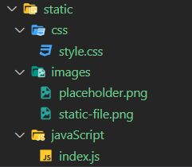

# flask_checklist

## Initial Setup

- [x] create directory
- [ ] create the virtual environment:

```
pipenv install flask pymysql
```
- [ ] activate the virtual environment:

```
pipenv shell
```

- [ ] create [server.py](server.py) with the following content:

```py
from flask_app import app
from flask_app.controllers import models

if __name__=="__main__":    
    app.run(debug=True)
```
**[server.py](server.py) is subject to SEVERAL modifications!!!**

- [ ] create database connection with [mysqlconnection.py](flask_app/config/mysqlconnection.py) with the following content:

```py
# a cursor is the object we use to interact with the database
import pymysql.cursors
# this class will give us an instance of a connection to our database
class MySQLConnection:
    def __init__(self, db):
        # change the user and password as needed
        connection = pymysql.connect(host = 'localhost',
                                    user = 'root', 
                                    password = 'root', 
                                    db = db,
                                    charset = 'utf8mb4',
                                    cursorclass = pymysql.cursors.DictCursor,
                                    autocommit = True)
        # establish the connection to the database
        self.connection = connection
    # the method to query the database
    def query_db(self, query, data=None):
        with self.connection.cursor() as cursor:
            try:
                query = cursor.mogrify(query, data)
                print("Running Query:", query)
     
                cursor.execute(query, data)
                if query.lower().find("insert") >= 0:
                    # INSERT queries will return the ID NUMBER of the row inserted
                    self.connection.commit()
                    return cursor.lastrowid
                elif query.lower().find("select") >= 0:
                    # SELECT queries will return the data from the database as a LIST OF DICTIONARIES
                    result = cursor.fetchall()
                    return result
                else:
                    # UPDATE and DELETE queries will return nothing
                    self.connection.commit()
            except Exception as e:
                # if the query fails the method will return FALSE
                print("Something went wrong", e)
                return False
            finally:
                # close the connection
                self.connection.close() 
# connectToMySQL receives the database we're using and uses it to create an instance of MySQLConnection
def connectToMySQL(db):
    return MySQLConnection(db)
```

## Create `flask_app` Package

- all flask files except `server.py` will now be in [flask_app](flask_app/__init__.py)
- [ ] the [`__init__.py`](./flask_app/__init__.py) is what makes `flask_app` a package. It has the following content:

```py
from flask import Flask, render_template, request, redirect

app = Flask(__name__)
```
### Models

- [ ] add a [models](flask_app/models/model.py) directory with the following content:

```py
from flask_app.config.mysqlconnection import connectToMySQL

DATABASE = 'checklist'

class Model:
    def __init__(self, data:dict) -> None:
        self.id = data['id']
        self.column1 = data['column1']
        self.column2 = data['column2']
        self.column3 = data['column3']
        self.created_at = data['created_at']
        self.updated_at = data['updated_at']


    # ! CREATE
    @classmethod
    def save(cls, data:dict) -> int:
        query = "INSERT INTO models (column1,column2,column3) VALUES (%(column1)s,%(column2)s,%(column3)s);"
        result = connectToMySQL(DATABASE).query_db(query,data)
        return result

    # ! READ/RETRIEVE ALL
    @classmethod
    def get_all(cls) -> list:
        query = "SELECT * FROM models;"
        results = connectToMySQL(DATABASE).query_db(query)
        models = []
        for u in results:
            models.append( cls(u) )
        return models
    
    # ! READ/RETRIEVE ONE
    @classmethod
    def get_one(cls,data:dict) -> object:
        query  = "SELECT * FROM models WHERE id = %(id)s";
        result = connectToMySQL(DATABASE).query_db(query,data)
        return cls(result[0])

    # ! UPDATE
    @classmethod
    def update(cls,data:dict) -> int:
        query = "UPDATE models SET column1=%(column1)s,column2=%(column2)s,column3=%(column3)s,updated_at=NOW() WHERE id = %(id)s;"
        return connectToMySQL(DATABASE).query_db(query,data)

    # ! DELETE
    @classmethod
    def destroy(cls,data:dict):
        query  = "DELETE FROM models WHERE id = %(id)s;"
        return connectToMySQL(DATABASE).query_db(query,data)
```


### Templates(aka Views)

#### Index

- [ ] create a [templates](flask_app/templates/index.html) directory with an `index.html` file as follows:

```html
<!DOCTYPE html>
<html lang="en">
<head>
    <meta charset="UTF-8">
    <meta http-equiv="X-UA-Compatible" content="IE=edge">
    <meta name="viewport" content="width=device-width, initial-scale=1.0">
    <link href="https://cdn.jsdelivr.net/npm/bootstrap@5.1.3/dist/css/bootstrap.min.css" rel="stylesheet" integrity="sha384-1BmE4kWBq78iYhFldvKuhfTAU6auU8tT94WrHftjDbrCEXSU1oBoqyl2QvZ6jIW3" crossorigin="anonymous">
    <link rel="stylesheet" type="text/css" href="{{ url_for('static', filename='css/style.css') }}">
    <script type="text/javascript" src="{{ url_for('static', filename='javaScript/index.js') }}"></script>
    <title>index</title>
</head>
<body>
    <h1>Index</h1>

</body>
</html>
```

#### Models (show all models)

- [ ] add [models.html](flask_app/templates/models.html):

```html
<!DOCTYPE html>
<html lang="en">
<head>
    <meta charset="UTF-8">
    <meta http-equiv="X-UA-Compatible" content="IE=edge">
    <meta name="viewport" content="width=device-width, initial-scale=1.0">
    <!-- CSS only -->
    <link href="https://cdn.jsdelivr.net/npm/bootstrap@5.0.2/dist/css/bootstrap.min.css" rel="stylesheet" integrity="sha384-EVSTQN3/azprG1Anm3QDgpJLIm9Nao0Yz1ztcQTwFspd3yD65VohhpuuCOmLASjC" crossorigin="anonymous">
    <title>models</title>
</head>
<body>
    <h1 class="text-center">Here are our models!!!</h1>
    <table class="table table-hover">
        <thead>
            <tr>
                <th>Column One</th>
                <th>Column Two</th>
                <th>Column Three</th>
                <th>Created At</th>
                <th>Actions</th>
            </tr>
        </thead>
        <tbody>
            
            <tr>
                <td>{{ model.column1 }}</td>
                <td>{{ model.column2 }}</td>
                <td>{{ model.column3}}</td>
                <td>{{ model.created_at.strftime("%b %d %Y") }}</td>
                <td>
                    <a href="/model/show/{{ model.id }}">Show</a> |
                    <a href="/model/edit/{{ model.id }}">Edit</a> |
                    <a href="/model/destroy/{{ model.id }}">Delete</a>
                </td>
            </tr>
            
        </tbody>
    </table>
    <a href="/model/new" class="btn btn-primary">Add a model</a>
</body>
</html>
```
#### New (create a model)

  - [ ] add [new_model.html](flask_app/templates/new_model.html):

```html
<!DOCTYPE html>
<html lang="en">
<head>
    <meta charset="UTF-8">
    <meta http-equiv="X-UA-Compatible" content="IE=edge">
    <meta name="viewport" content="width=device-width, initial-scale=1.0">
    <!-- CSS only -->
    <link href="https://cdn.jsdelivr.net/npm/bootstrap@5.0.2/dist/css/bootstrap.min.css" rel="stylesheet" integrity="sha384-EVSTQN3/azprG1Anm3QDgpJLIm9Nao0Yz1ztcQTwFspd3yD65VohhpuuCOmLASjC" crossorigin="anonymous">
    <title>Create model</title>
</head>
<body>

    <form action="/model/create" method="post" class="col-6 mx-auto">
        <h2 class="text-center">Add model</h2>
        <div class="form-group">
            <label for="column1">column1:</label>
            <input type="text" name="column1"  class="form-control">
        </div>
        <div class="form-group">
            <label for="column2">column2:</label>
            <input type="text" name="column2"  class="form-control">
        </div>
        <div class="form-group">
            <label for="column3">column3:</label>
            <input type="text" name="column3"  class="form-control">
        </div>
        <input type="submit" value="Add model" class="btn btn-success">
    </form>
</body>
</html>
```

#### Edit (edit a model)

  - [ ] add [edit_model.html](flask_app/templates/edit_model.html):

```html
<!DOCTYPE html>
<html lang="en">
<head>
    <meta charset="UTF-8">
    <meta http-equiv="X-UA-Compatible" content="IE=edge">
    <meta name="viewport" content="width=device-width, initial-scale=1.0">
    <!-- CSS only -->
    <link href="https://cdn.jsdelivr.net/npm/bootstrap@5.0.2/dist/css/bootstrap.min.css" rel="stylesheet" integrity="sha384-EVSTQN3/azprG1Anm3QDgpJLIm9Nao0Yz1ztcQTwFspd3yD65VohhpuuCOmLASjC" crossorigin="anonymous">
    <title>Edit model</title>
</head>
<body>

    <form action="/model/update" method="post" class="col-6 mx-auto">
        <h2 class="text-center">Edit {{model.id}}</h2>
        <input type="hidden" name="id" value={{model.id}}>
        <div class="form-group">
            <label for="column1">column1:</label>
            <input type="text" name="column1"  class="form-control" value="{{model.column1}}">
        </div>
        <div class="form-group">
            <label for="column2">column2:</label>
            <input type="text" name="column2" class="form-control" value="{{model.column2}}">
        </div>
        <div class="form-group">
            <label for="column3">column3:</label>
            <input type="text" name="column3"  class="form-control" value="{{model.column3}}">
        </div>
        <input type="submit" value="Update model" class="btn btn-success">
    </form>
</body>
</html>
```

#### Show (show an individual model)

- [ ] add [show_model.html](flask_app/templates/show_model.html):

```html
<!DOCTYPE html>
<html lang="en">
<head>
    <meta charset="UTF-8">
    <meta http-equiv="X-UA-Compatible" content="IE=edge">
    <meta name="viewport" content="width=device-width, initial-scale=1.0">
    <link href="https://cdn.jsdelivr.net/npm/bootstrap@5.0.2/dist/css/bootstrap.min.css" rel="stylesheet" integrity="sha384-EVSTQN3/azprG1Anm3QDgpJLIm9Nao0Yz1ztcQTwFspd3yD65VohhpuuCOmLASjC" crossorigin="anonymous">
    <title>model</title>
</head>
<body>
    <h2 class="text-center">model {{model.id}}</h2>
    <p>column1 {{model.column1}}</p>
    <p>column2: {{model.column2}}</p>
    <p>column3: {{model.column3}}</p>

    <p>Created ON: {{model.created_at.strftime("%b %d %Y")}}</p>
    <p>Last Updated: {{  model.updated_at.strftime("%b %d %Y")}}</p>
</body>
</html>
```


### Controllers

- [ ] add a [controllers](flask_app/controllers/models.py) directory:

```py
from flask import render_template, request, redirect
from flask_app import app
from flask_app.models.model import Model

# ! ////// CREATE  //////
# TODO CREATE REQUIRES TWO ROUTES:
# TODO ONE TO DISPLAY THE FORM:
@app.route('/model/new')
def new_model():
    return render_template("new_model.html")

# TODO ONE TO HANDLE THE DATA FROM THE FORM
@app.route('/model/create',methods=['POST'])
def create_model():
    print(request.form)
    Model.save(request.form)
    return redirect('/models')

# ! ////// READ/RETRIEVE //////
# TODO ROOT ROUTE
@app.route('/')
def index():
    return redirect('/models')

# TODO READ ALL
@app.route('/models')
def models():
    return render_template("models.html",models=Model.get_all())

# TODO READ ONE
@app.route('/model/show/<int:id>')
def show_models(id):
    data ={ 
        "id":id
    }
    return render_template("show_model.html",model=Model.get_one(data))

# ! ///// UPDATE /////
# TODO UPDATE REQUIRES TWO ROUTES
# TODO ONE TO SHOW THE FORM
@app.route('/model/edit/<int:id>')
def edit_model(id):
    data ={ 
        "id":id
    }
    return render_template("edit_model.html",model=Model.get_one(data))

# TODO ONE TO HANDLE THE DATA FROM THE FORM
@app.route('/model/update',methods=['POST'])
def update_model():
    Model.update(request.form)
    return redirect('/models')

# ! ///// DELETE //////
@app.route('/model/destroy/<int:id>')
def destroy_model(id):
    data ={
        'id': id
    }
    Model.destroy(data)
    return redirect('/models')
```


### Static files

- [ ] add [static](flask_app/static) directory. File structure should look like this:



## Start the server

```
python server.py
```
 - [ ] visit [localhost:5000](http://localhost:5000/)


